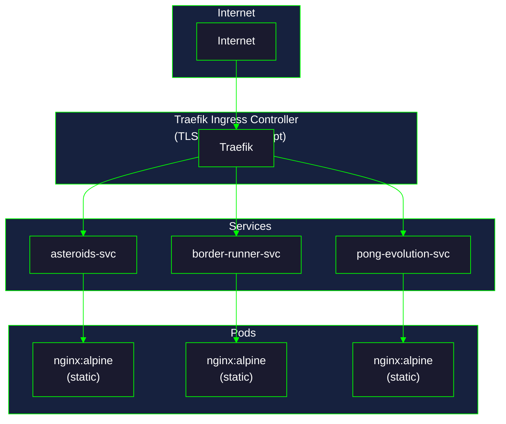

| | |
|---|---|
| **Last Updated** | 2025-12-19 |
| **Author** | Chrispy <alienresidents@gmail.com> |
| **Version** | 1.0.0 |

# Games Deployment Guide

This document describes how to deploy the browser-based games to Kubernetes.

## Table of Contents

- [Overview](#overview)
- [Conversation History](#conversation-history)
- [Prerequisites](#prerequisites)
- [Games Included](#games-included)
- [Architecture](#architecture)
- [Deployment Steps](#deployment-steps)
- [Updating Games](#updating-games)
- [Troubleshooting](#troubleshooting)

---

## Overview

Three browser-based HTML5 Canvas games deployed to Kubernetes with TLS termination via Traefik ingress controller.

| Game | URL | Description |
|------|-----|-------------|
| Asteroids | https://asteroids.YOUR_DOMAIN | Classic arcade game |
| Border Runner | https://border-runner.YOUR_DOMAIN | Stealth survival game |
| Pong Evolution (JS) | https://pong-evolution.YOUR_DOMAIN | Genetic algorithm tournament (client-side) |
| Pong Evolution (Flask) | https://pong-flask.YOUR_DOMAIN | Genetic algorithm tournament (server-side) |

---

## Conversation History

### Initial Request

> ultrathink analyse the directory /home/cdd/git/github/alienresidents/games, and for each game I want you to create a Dockerfile for each game, and then in a subdirectory of each create a k8s directory, and create kubernetes manifests for running the game through on the cdd.net.au domain. Ensure the domain does not already exist. Ensure that each game is session based. In order to figure out what is available, prompt me for tool usage, or any questions you have or clarifications you want/need. Make sure you include a history of this prompt and subsequent conversation for all documentation. Once you're done, commit and push to git. Lesssssss go!

### Clarifications Gathered

**Round 1:**
1. **DNS Target**: User will configure DNS; use `dig` to check existing entries
2. **TLS**: Yes, with Traefik's built-in Let's Encrypt resolver (`le`)
3. **Namespace**: `games`
4. **Subdomains**: Use proposed names (asteroids, border-runner, pong-evolution)

**Round 2:**
5. **Container Registry**: GCP Artifact Registry (use gcloud to create repos)
6. **Image Naming**: `games/<game>` pattern

**Round 3:**
7. **GCP Region**: `australia-southeast1` (Sydney)
8. **Container Tool**: Use Podman instead of Docker

### DNS Check Results

All subdomains were verified using `dig +short <subdomain>` before deployment.

---

## Prerequisites

- Kubernetes cluster with Traefik ingress controller
- GCP project with Artifact Registry enabled
- `gcloud` CLI authenticated
- `podman` or `docker` installed
- `kubectl` configured for your cluster

---

## Games Included

### Asteroids
Classic arcade game with vector graphics, physics-based movement, and progressive difficulty.

### Border Runner
Open-world stealth survival game with AI patrol systems and smuggling mechanics.

### Pong Evolution
AI vs AI Pong with genetic algorithms. Watch AI players evolve over generations.

---

## Architecture



**Session Handling**: All games use client-side localStorage for session persistence. No server-side session management required.

---

## Deployment Steps

### 1. Set Variables

```bash
# Configure these for your environment
export GCP_PROJECT="YOUR_PROJECT_ID"
export GCP_REGION="YOUR_GCP_REGION"           # e.g., australia-southeast1
export REGISTRY="${GCP_REGION}-docker.pkg.dev/${GCP_PROJECT}/games"
export YOUR_DOMAIN="YOUR_DOMAIN"               # e.g., example.com
export YOUR_EMAIL="YOUR_EMAIL"
```

### 2. Create GCP Artifact Registry Repository

```bash
# Set your GCP project
gcloud config set project ${GCP_PROJECT}

# Create the repository
gcloud artifacts repositories create games \
  --repository-format=docker \
  --location=${GCP_REGION} \
  --description="Browser-based games"
```

### 3. Authenticate Container Tool

For Podman:
```bash
gcloud auth print-access-token | podman login \
  -u oauth2accesstoken \
  --password-stdin \
  ${GCP_REGION}-docker.pkg.dev
```

For Docker:
```bash
gcloud auth configure-docker ${GCP_REGION}-docker.pkg.dev
```

### 4. Build and Push Images

```bash
# Build and push each game
for game in asteroids border-runner pong-evolution; do
  podman build -t ${REGISTRY}/${game}:latest games/${game}/
  podman push ${REGISTRY}/${game}:latest
done
```

### 5. Create Kubernetes Namespace

```bash
kubectl apply -f games/k8s/namespace.yaml
```

### 6. Create Image Pull Secret

```bash
ACCESS_TOKEN=$(gcloud auth print-access-token)

kubectl create secret docker-registry gcr-secret \
  --namespace=games \
  --docker-server=${GCP_REGION}-docker.pkg.dev \
  --docker-username=oauth2accesstoken \
  --docker-password="${ACCESS_TOKEN}" \
  --docker-email=${YOUR_EMAIL}
```

**Note**: The access token expires. For production, use a service account key or Workload Identity.

### 7. Update Deployment Manifests

Edit the deployment files to match your registry:
- `games/asteroids/k8s/deployment.yaml`
- `games/border-runner/k8s/deployment.yaml`
- `games/pong-evolution/k8s/deployment.yaml`

Change the `image` field to match your registry URL:
```yaml
image: ${GCP_REGION}-docker.pkg.dev/${GCP_PROJECT}/games/<game>:latest
```

### 8. Update Ingress Hosts

Edit the ingress files to match your domain:
- `games/asteroids/k8s/ingress.yaml`
- `games/border-runner/k8s/ingress.yaml`
- `games/pong-evolution/k8s/ingress.yaml`

Change the `host` field to your domain:
```yaml
host: asteroids.YOUR_DOMAIN
```

### 9. Deploy to Kubernetes

```bash
# Deploy all games
kubectl apply -f games/asteroids/k8s/
kubectl apply -f games/border-runner/k8s/
kubectl apply -f games/pong-evolution/k8s/

# Verify deployment
kubectl get pods,svc,ingress -n games
```

---

## Updating Games

### Update Game Code

1. Make changes to the game files (index.html, game.js, style.css)
2. Rebuild and push the image:
   ```bash
   podman build -t ${REGISTRY}/${game}:latest games/${game}/
   podman push ${REGISTRY}/${game}:latest
   ```
3. Restart the deployment:
   ```bash
   kubectl rollout restart deployment/${game} -n games
   ```

### Update Kubernetes Manifests

```bash
kubectl apply -f games/${game}/k8s/
```

---

## Troubleshooting

### Image Pull Errors

If pods show `ImagePullBackOff`:
1. Check the secret exists: `kubectl get secret gcr-secret -n games`
2. Recreate the secret with a fresh access token
3. Verify the image URL is correct

### 403 Forbidden from nginx

If the health checks fail with 403:
- Ensure files have correct permissions (644)
- Check the Dockerfile uses `COPY --chmod=644`

### TLS Certificate Issues

Traefik handles TLS automatically via Let's Encrypt:
- Check Traefik logs: `kubectl logs -n traefik -l app.kubernetes.io/name=traefik`
- Verify DNS is correctly configured

### View Pod Logs

```bash
kubectl logs -n games deployment/asteroids
kubectl logs -n games deployment/border-runner
kubectl logs -n games deployment/pong-evolution
```

---

## File Structure

```
games/
├── DEPLOYMENT.md           # This file
├── k8s/
│   └── namespace.yaml      # Shared namespace
├── asteroids/
│   ├── Dockerfile
│   ├── index.html
│   ├── game.js
│   ├── style.css
│   └── k8s/
│       ├── deployment.yaml
│       ├── service.yaml
│       └── ingress.yaml
├── border-runner/
│   ├── Dockerfile
│   ├── index.html
│   ├── game.js
│   ├── style.css
│   └── k8s/
│       ├── deployment.yaml
│       ├── service.yaml
│       └── ingress.yaml
├── pong-evolution/
│   ├── Dockerfile
│   ├── index.html
│   ├── game.js
│   ├── style.css
│   └── k8s/
│       ├── deployment.yaml
│       ├── service.yaml
│       └── ingress.yaml
└── llm/
    └── pong-evolution/     # Python/Flask version
        ├── Dockerfile
        ├── app.py
        ├── game.py
        ├── genetic.py
        ├── tournament.py
        ├── requirements.txt
        ├── templates/
        ├── static/
        └── k8s/
            ├── deployment.yaml
            ├── service.yaml
            └── ingress.yaml
```

---

## Container Registry Details

| Setting | Value |
|---------|-------|
| **Registry** | GCP Artifact Registry |
| **Location** | `${GCP_REGION}` |
| **Repository** | games |

**Image URL Pattern:**
```
${GCP_REGION}-docker.pkg.dev/${GCP_PROJECT}/games/<game>:latest
```

---

## Kubernetes Configuration

| Setting | Value |
|---------|-------|
| **Namespace** | games |
| **Ingress Controller** | Traefik |
| **TLS** | Let's Encrypt via Traefik |
| **Replicas** | 1 per game |

**Resource Limits (per pod):**
- Memory: 32Mi request, 64Mi limit
- CPU: 10m request, 100m limit

---

## License

MIT License - See individual game directories for details.

---

👽 Directed by Chrispy <alienresidents@gmail.com>
