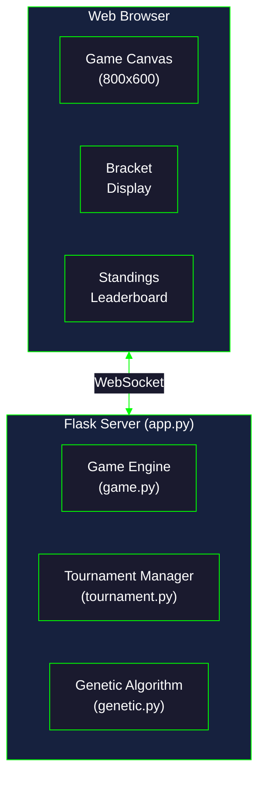

| | |
|---|---|
| **Last Updated** | 2025-12-19 |
| **Author** | Chrispy <alienresidents@gmail.com>, Claude Code (Opus 4.5) |
| **Version** | 1.4.1 |

# Browser Games Collection

A collection of browser-based games created entirely by Claude Code. Each game was generated from a single natural language prompt.

## Table of Contents

- [Games](#games)
  - [Border Runner](#border-runner)
  - [Asteroids](#asteroids)
  - [Pong Evolution (Vanilla JS)](#pong-evolution-vanilla-js)
  - [Pong Evolution (Python/Flask)](#pong-evolution-pythonflask)
- [Running the Games](#running-the-games)
- [Prompts Used](#prompts-used)
- [Technical Details](#technical-details)
- [Statistics](#statistics)
- [Claude Code Rules](#claude-code-rules)
- [Prompt Timeline](#prompt-timeline)
- [License](#license)

## Live Games

| Game | URL |
|------|-----|
| Asteroids | https://asteroids.cdd.net.au |
| Border Runner | https://border-runner.cdd.net.au |
| Pong Evolution (JS) | https://pong-evolution.cdd.net.au |
| Pong Evolution (Flask) | https://pong-flask.cdd.net.au |

---

## Games

### Border Runner

A 2D top-down open-world survival game where you play as a smuggler transporting contraband across a border wall.

**Features:**
- WASD keyboard controls with sprint
- Persistent world state via localStorage
- Stealth mechanics (hiding in bushes)
- Patrol AI with detection and chase behavior
- Health, stamina, and wanted level systems
- Minimap navigation
- "The Wall" as a central obstacle with limited gaps

**Controls:** `W/A/S/D` move, `SHIFT` sprint, `E` pickup, `SPACE` drop

**Directory:** [`border-runner/`](border-runner/)

---

### Asteroids

A classic Asteroids arcade game clone with vector-style graphics and physics-based movement.

**Features:**
- Ship rotation and thrust with inertia
- Asteroids split into smaller pieces when destroyed
- Hyperspace emergency teleportation
- Progressive difficulty (more asteroids per level)
- Extra life every 10,000 points
- High score persistence
- Particle effects for explosions and thrust
- Configurable ship handling (rotation speed, thrust)
- Debug logging system

**Controls:** `W` thrust, `A/D` rotate, `SPACE` fire, `S` hyperspace, `P` pause

**Directory:** [`asteroids/`](asteroids/)

---

### Pong Evolution (Vanilla JS)

An AI-vs-AI Pong game featuring genetic algorithms that evolve over successive tournament generations. Pure client-side implementation.

**Features:**
- Computer vs computer gameplay (no human players)
- 12-gene genome controlling paddle AI behavior:
  - Tracking and prediction weights
  - Reaction delay and movement smoothing
  - Defensive/offensive strategies
  - Error rates and jitter
- Tournament bracket system with configurable rounds
- Evolution after each tournament:
  - Top 50% survive
  - Elitism (best player preserved)
  - Crossover and mutation breeding
- Real-time visualization of matches
- Genome viewer to inspect AI parameters
- All-time leaderboard tracking
- Event logging

**Web UI Controls:**
- Population size (4-32 players)
- Points to win per game (1-21)
- Matches per pairing (best of 1-9)
- Game speed multiplier (1-10x)
- Mutation rate (1-50%)

**Directory:** [`pong-evolution/`](pong-evolution/)

---

### Pong Evolution (Python/Flask)

An alternative server-side implementation using Python, Flask, and WebSockets. Features 32 AI players competing in single-elimination tournaments.

**Features:**
- 32 AI players with unique genetic traits
- Single elimination tournaments (5 rounds to champion)
- 6-gene chromosome per AI:
  - `reaction_time` - Response speed to ball movement
  - `prediction_depth` - How far ahead to predict ball position
  - `aggression` - Tendency to chase predicted position
  - `noise_tolerance` - Random movement factor
  - `speed_scaling` - Maximum paddle movement speed
  - `anticipation` - Weight given to ball velocity vs position
- Server-side game simulation at 60 FPS
- WebSocket real-time updates
- Tournament bracket and standings display

**Architecture:**


**Genetic Algorithm:**
- Tournament selection (3 random individuals compete)
- Single-point crossover with 10% per-gene uniform crossover
- Gaussian mutation (σ=0.2) with 10% probability per gene
- Elitism: Top 50% survive unchanged

**Fitness Function:**
```
fitness = (wins × 100) + (point_differential × 10) + (points_scored × 1)
```

**Directory:** [`llm/pong-evolution/`](llm/pong-evolution/)

---

## Running the Games

### Vanilla JS Games (Static Server)

Each vanilla JS game requires only a static file server. No build process or dependencies needed.

```bash
# Border Runner
cd border-runner && python3 -m http.server 8000 --bind 0.0.0.0

# Asteroids
cd asteroids && python3 -m http.server 8001 --bind 0.0.0.0

# Pong Evolution (JS)
cd pong-evolution && python3 -m http.server 8002 --bind 0.0.0.0
```

Or with Node.js: `npx serve <directory> -p <port>`

### Kubernetes Deployment

The vanilla JS games can be deployed to Kubernetes using the included manifests. Each game is containerized with nginx:alpine and served via Traefik ingress with automatic TLS certificates.

```bash
# Quick deploy (after configuring your registry and domain)
kubectl apply -f k8s/namespace.yaml
kubectl apply -f asteroids/k8s/
kubectl apply -f border-runner/k8s/
kubectl apply -f pong-evolution/k8s/
```

See [DEPLOYMENT.md](DEPLOYMENT.md) for complete instructions including:
- GCP Artifact Registry setup
- Building and pushing container images
- Kubernetes manifest configuration
- Troubleshooting guide

---

### Python/Flask Pong Evolution

```bash
cd llm/pong-evolution

# Create virtual environment and install dependencies
python3 -m venv .venv
source .venv/bin/activate
pip install -r requirements.txt

# Start server on port 8003
python app.py
```

Then open http://localhost:8003 in your browser.

---

## Prompts Used

The following prompts were used to generate each game.

### Border Runner Prompt

```
ultrathink javascript game that runs in a browser. 2d, top down, open world,
persistent world, survival, obstacles interfere with normal play with penalties,
you are playing a drug smuggler, there is a donald trump wall. keyboard control
with W,A,S,D. create all files required in the game/ directory.
```

**Follow-up refinements:**
- "drop isn't working" → Fixed interaction distance and added feedback messages

---

### Asteroids Prompt

```
Please create an Asteroids clone also playable in a web browser, and with a
server that binds to all IP addresses, and runs on a port that isn't used.
```

**Follow-up refinements:**
- "firing doesn't work, it freezes the game, make sure you have sufficient logging to troubleshoot" → Added `getCollisionRadius()` method to Bullet class (was missing, causing crash)
- "the spin rate is way too fast, make it adjustable, also adjustable thrust" → Made `SHIP_ROTATION_SPEED` and `SHIP_THRUST` configurable with documented ranges

---

### Pong Evolution Prompt

Used for both implementations:

```
pong like game, computer vs. computer, each of the paddles uses a different
algorythm, a tournament style ladder system, to find out who the best is,
make them genetic algorythms, and after each successive tournament, you breed
them so they evolve, and then re-run the tournament. Make the tournament rounds
configurable in the webui. Also listen on all IP addresses, on a free TCP port.
```

**Planning clarifications (Python version):**
- Population: 32 players
- Tournament format: Single elimination

---

### Mobile Touch Controls Prompt

```
let's add mobile phone support now please, so a keyboard isn't required.
Also, ensure we add this to the prompts used section.
```

**Implementation:**
- **Asteroids**: Fixed touch buttons (◀ ▲ ▶ for rotation/thrust, FIRE, HYPER, ⏸)
- **Border Runner**: Virtual joystick for movement + action buttons (PICKUP, DROP, SPRINT)
- **Pong Evolution**: No changes needed (AI vs AI gameplay - no player input)

Touch controls auto-detect mobile devices and support multi-touch for simultaneous actions.

---

### Kubernetes Deployment Prompt

```
ultrathink analyse the directory /home/cdd/git/github/alienresidents/games, and
for each game I want you to create a Dockerfile for each game, and then in a
subdirectory of each create a k8s directory, and create kubernetes manifests
for running the game through on the cdd.net.au domain. Ensure the domain does
not already exist. Ensure that each game is session based. In order to figure
out what is available, prompt me for tool usage, or any questions you have or
clarifications you want/need. Make sure you include a history of this prompt
and subsequent conversation for all documentation. Once you're done, commit
and push to git. Lesssssss go!
```

**Clarifications gathered:**
- DNS: User configures DNS; use `dig` to check existing entries
- TLS: Traefik's built-in Let's Encrypt resolver (`le`)
- Namespace: `games`
- Subdomains: asteroids, border-runner, pong-evolution
- Container Registry: GCP Artifact Registry
- Image naming: `games/<game>` pattern
- GCP Region: `australia-southeast1` (Sydney)
- Container Tool: Podman (not Docker)

**Implementation:**
- Created Dockerfiles using nginx:alpine for static games
- Created K8s manifests (deployment, service, ingress) for each game
- Session handling via client-side localStorage
- Full documentation in [DEPLOYMENT.md](DEPLOYMENT.md)

---

### Deployment Infrastructure Prompts

**Image Versioning:**
```
let's use versioning tags based on the timestamp they were built, and patch
the deployment for new images.
```

**Service Account Setup:**
```
let's create a service account in GCP so we don't have to worry about token timeout
```

```
make sure we encrypt the service account key with "sops". Also, update
documentation for this step, but make it generic.
```

```
when using sops, use --extract, and --set.
```

**Scripts Directory:**
```
create a scripts/ directory with the commands used for GCP etc, but make the
variables configurable, and default to sane but non-sensitive defaults.
```

**Infrastructure Script:**
```
Also, create a script for creating infrastructure, so as to not pass the
sensitive info through an LLM.
```

**Implementation:**
- Created `scripts/setup-gcp-infrastructure.bash` - creates Artifact Registry and service account
- Created `scripts/setup-image-pull-secret.bash` - creates K8s image pull secret with sops encryption
- Service account keys encrypted with sops using GCP KMS
- Config file support (`.gcp-config`) to avoid passing sensitive values
- Updated `.sops.yaml` with rules for `secrets/` directory
- Image tags use `YYYYMMDD-HHMMSS` format for versioning
- Documentation updated in `DEPLOYMENT.md` with automated and manual options

---

### Static Ports Prompt

```
make sure you add all of the prompts used thus far to the README, we want to
keep track of this history. Also, let's change the random ports to static
ports for our games.
```

**Implementation:**
- Assigned static ports to each game for consistent local development
- Updated all README files with correct port assignments

| Game | Port |
|------|------|
| Border Runner | 8000 |
| Asteroids | 8001 |
| Pong Evolution (JS) | 8002 |
| Pong Evolution (Flask) | 8003 |

---

### Prompt Documentation Verification

```
have you documented all of the prompts used so far? If not, please do,
including this one!
```

**Implementation:**
- Added Kubernetes Deployment Prompt (was only in DEPLOYMENT.md)
- Verified all prompts are documented in chronological order
- Added this meta-prompt for completeness

---

### Version Bump Reminder

```
have you updated the README version?
```

**Implementation:**
- Bumped version from 1.2.0 to 1.3.0

---

### Meta-Prompt Inclusion

```
include this and that prompt in the README too please.
```

**Implementation:**
- Added both prompts to maintain complete history

---

### Version and Timeline Prompt

```
You forgot to update the version of the README, so add a minor version and a
patch increment too, and add this prompt to the rest.
```

**Implementation:**
- Bumped version from 1.3.0 to 1.4.1
- Added this prompt to documentation and timeline

---

## Technical Details

### Stack Comparison

| Component | Vanilla JS Games | Python Pong |
|-----------|------------------|-------------|
| Language | JavaScript (ES6+) | Python 3.10+ |
| Rendering | HTML5 Canvas | HTML5 Canvas |
| Server | Static file server | Flask + WebSockets |
| Communication | N/A | Socket.IO |
| Storage | localStorage | In-memory |
| Dependencies | None | flask, flask-socketio, eventlet |

### File Structures

**Vanilla JS Games:**
```
game-name/
├── README.md               # Game-specific documentation
├── GAME_SPECIFICATION.md   # LLM-optimized recreation guide
├── index.html              # HTML structure and UI
├── style.css               # Styling
└── game.js                 # All game logic
```

**Python Pong Evolution:**
```
llm/pong-evolution/
├── app.py                  # Flask server, WebSocket handlers
├── game.py                 # Pong physics engine, AI controller
├── genetic.py              # Chromosome, crossover, mutation
├── tournament.py           # Bracket generation, match scheduling
├── requirements.txt        # Python dependencies
├── templates/
│   └── index.html          # Web UI structure
└── static/
    ├── game.js             # Canvas rendering, WebSocket client
    └── style.css           # Dark theme styling
```

### Game Specifications

All vanilla JS games include `GAME_SPECIFICATION.md` files - comprehensive technical documents optimized for LLMs to recreate the games:
- Complete configuration constants
- Game state structures
- Entity class specifications
- Algorithm descriptions (AI, physics, genetics)
- Implementation guides
- Common pitfalls

---

## Statistics

### Lines of Code by Game

| Game | HTML | CSS | JS | Python | Spec | README | Total |
|------|------|-----|-----|--------|------|--------|-------|
| Border Runner | 62 | 212 | 996 | - | ~500 | ~100 | ~1,870 |
| Asteroids | 44 | 147 | 688 | - | ~600 | ~100 | ~1,579 |
| Pong Evolution (JS) | 119 | 431 | 1,127 | - | ~500 | ~120 | ~2,297 |
| Pong Evolution (Py) | 83 | 358 | 272 | 989 | - | - | ~1,702 |
| **Total** | **308** | **1,148** | **3,083** | **989** | **~1,600** | **~320** | **~7,448** |

### Complexity Metrics

| Game | Classes/Modules | Functions | Config Options |
|------|-----------------|-----------|----------------|
| Border Runner | 6 classes | ~30 | 17 |
| Asteroids | 4 classes | ~25 | 21 |
| Pong Evolution (JS) | 5 classes | ~40 | 12 genes + 5 UI |
| Pong Evolution (Py) | 4 modules | ~50 | 6 genes + 4 UI |

---

## Claude Code Rules

This project was created using [Claude Code](https://claude.com/claude-code) with custom rules defined in [CLAUDE.md](CLAUDE.md). These rules govern how Claude Code assists with development, including:

- Git commit conventions and signatures
- Code quality standards
- Language-specific conventions (Python, JavaScript, Go, Bash)
- Testing and documentation requirements

---

## Prompt Timeline

A chronological record of all prompts used to create and evolve this project.

| # | Date | Prompt | Result |
|---|------|--------|--------|
| 1 | 2025-12 | "ultrathink javascript game... 2d, top down, open world... drug smuggler... donald trump wall" | Border Runner game |
| 2 | 2025-12 | "drop isn't working" | Fixed interaction distance |
| 3 | 2025-12 | "Please create an Asteroids clone... binds to all IP addresses" | Asteroids game |
| 4 | 2025-12 | "firing doesn't work, it freezes the game" | Fixed bullet collision |
| 5 | 2025-12 | "the spin rate is way too fast, make it adjustable" | Configurable ship controls |
| 6 | 2025-12 | "pong like game, computer vs. computer... genetic algorythms... tournament" | Pong Evolution (JS & Flask) |
| 7 | 2025-12 | "ultrathink analyse... create a Dockerfile for each game... k8s directory... kubernetes manifests" | K8s deployment infrastructure |
| 8 | 2025-12 | "let's add mobile phone support... so a keyboard isn't required" | Touch controls for mobile |
| 9 | 2025-12 | "let's use versioning tags based on the timestamp" | Timestamp-based image tags |
| 10 | 2025-12 | "let's create a service account in GCP" | GCP service account setup |
| 11 | 2025-12 | "make sure we encrypt the service account key with 'sops'" | SOPS encryption |
| 12 | 2025-12 | "when using sops, use --extract, and --set" | SOPS extraction method |
| 13 | 2025-12 | "create a scripts/ directory... make the variables configurable" | setup-image-pull-secret.bash |
| 14 | 2025-12 | "create a script for creating infrastructure" | setup-gcp-infrastructure.bash |
| 15 | 2025-12 | "make sure you add all of the prompts... change the random ports to static ports" | Static ports + prompt docs |
| 16 | 2025-12 | "have you documented all of the prompts used so far?" | Prompt verification |
| 17 | 2025-12 | "have you updated the README version?" | Version bump to 1.3.0 |
| 18 | 2025-12 | "include this and that prompt in the README too please" | Meta-prompt inclusion |
| 19 | 2025-12 | "add a full timeline of prompts... include this one too :)" | This timeline |
| 20 | 2025-12 | "You forgot to update the version... add a minor version and a patch increment" | Version 1.4.1 |

---

## License

👽 Directed by Chrispy <alienresidents@gmail.com>

MIT License - These games were generated by Claude Code and are provided as-is for educational and entertainment purposes.

---

*Generated with Claude Code (Opus 4.5) - December 2025*
