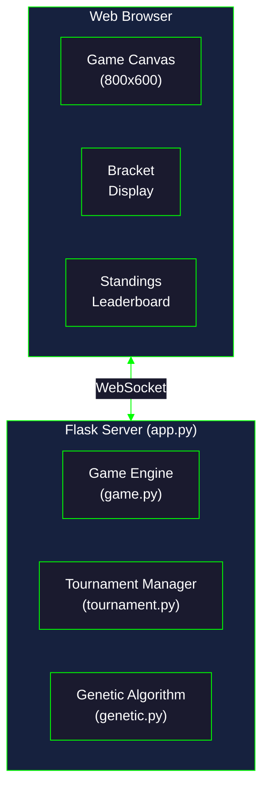

| | |
|---|---|
| **Last Updated** | 2025-12-19 |
| **Author** | Chrispy <alienresidents@gmail.com>, Claude (Opus 4.5) |
| **Version** | 1.0.0 |

# LLM-Generated Games

A collection of games created entirely by Claude using Claude Code.

---

## Games

### [Pong Evolution Tournament](pong-evolution/)

**Live:** https://pong-flask.cdd.net.au

A web-based Pong game where AI-controlled paddles compete in tournaments. Each paddle uses a genetic algorithm that evolves through breeding after each tournament round.

---

## Table of Contents

- [Games](#games)
- [Pong Evolution Tournament](#pong-evolution-tournament)
  - [Features](#features)
  - [Architecture](#architecture)
  - [Installation](#installation)
  - [Usage](#usage)
  - [Genetic Algorithm Design](#genetic-algorithm-design)
- [File Structure](#file-structure)
- [Prompts Used to Create This Project](#prompts-used-to-create-this-project)
- [Technical Details](#technical-details)

---

## Pong Evolution Features

- **32 AI Players**: Each with unique genetic traits controlling paddle behavior
- **Single Elimination Tournaments**: 5 rounds to determine a champion
- **Genetic Evolution**: Winners breed, losers are replaced by offspring
- **Real-time Visualization**: Watch matches live in the browser
- **Configurable Speed**: 1x, 2x, 5x, or 10x game speed
- **Multiple Tournament Rounds**: Run successive evolution cycles
- **Tournament Bracket Display**: Visual bracket with match results
- **Standings Leaderboard**: Track wins, losses, and generations
- **Event Log**: Real-time match commentary

---

## Architecture



---

## Installation

### Prerequisites

- Python 3.10+
- [uv](https://github.com/astral-sh/uv) (recommended) or pip

### Setup

```bash
cd pong-evolution

# Create virtual environment and install dependencies
uv venv
uv pip install flask flask-socketio eventlet

# Or with pip
python -m venv .venv
source .venv/bin/activate
pip install -r requirements.txt
```

---

## Usage

### Start the Server

```bash
cd pong-evolution
source .venv/bin/activate
python app.py
```

The server will:
- Find a free TCP port automatically
- Listen on all interfaces (0.0.0.0)
- Print the URL to access the web UI

### Web Interface

1. **Initialize**: Click to create 32 random AI players
2. **Tournament Rounds**: Set how many evolution cycles to run (1-100)
3. **Speed**: Select game speed (1x, 2x, 5x, 10x)
4. **Start Tournament**: Begin the competition
5. **Pause/Resume**: Control tournament execution

### Watch Evolution

- Each tournament determines a champion through single elimination
- After each tournament, the population evolves:
  - Top 50% survive unchanged
  - Bottom 50% replaced by offspring of winners
  - Random mutations applied to offspring
- Run multiple tournaments to see strategies evolve

---

## Genetic Algorithm Design

### Chromosome Structure

Each AI paddle is defined by 6 genes (values 0.0 to 1.0):

| Gene | Description | Low Value | High Value |
|------|-------------|-----------|------------|
| `reaction_time` | Response speed to ball movement | Slow, delayed | Instant response |
| `prediction_depth` | How far ahead it predicts ball position | No prediction | Full trajectory |
| `aggression` | Tendency to chase predicted position | Defensive, stays centered | Aggressive pursuit |
| `noise_tolerance` | Random movement factor | Deterministic | Chaotic/unpredictable |
| `speed_scaling` | Maximum paddle movement speed | Slow movement | Fast movement |
| `anticipation` | Weight given to ball velocity vs position | Position focused | Velocity focused |

### Evolution Process

1. **Tournament Selection**: 3 random individuals compete, fittest selected as parent
2. **Crossover**: Single-point crossover with 10% per-gene uniform crossover
3. **Mutation**: Gaussian noise (σ=0.2) applied with 10% probability per gene
4. **Elitism**: Top 50% survive unchanged to next generation

### Fitness Function

```
fitness = (wins × 100) + (point_differential × 10) + (points_scored × 1)
```

---

## File Structure

```
llm/
├── README.md                   # This file
└── pong-evolution/
    ├── app.py                  # Flask server, WebSocket handlers, game loop
    ├── game.py                 # Pong physics engine, AI paddle controller
    ├── genetic.py              # Chromosome, crossover, mutation, evolution
    ├── tournament.py           # Bracket generation, match scheduling
    ├── requirements.txt        # Python dependencies
    ├── templates/
    │   └── index.html          # Web UI structure
    └── static/
        ├── game.js             # Canvas rendering, WebSocket client
        └── style.css           # Dark theme styling
```

---

## Prompts Used to Create This Project

This project was created entirely by Claude (Opus 4.5) using Claude Code based on the following prompts:

### Initial Prompt

> pong like game, computer vs. computer, each of the paddles uses a different algorythm, a tournament style ladder system, to find out who the best is, make them genetic algorythms, and after each successive tournament, you breed them so they evolve, and then re-run the tournament. Make the tournament rounds configurable in the webui. Also listen on all IP addresses, on a free TCP port.

### Planning Clarification Questions

Claude asked the following clarifying questions:

1. **Location**: Where should the project be created?
   - Answer: `/home/chrispy/pong-evolution/` (later moved to `alienresidents/games/llm/`)

2. **Population**: How many AI players should compete?
   - Answer: 32 players

3. **Tournament Format**: Single elimination or round robin?
   - Answer: Single elimination

### Follow-up Prompt

> save all source in /home/chrispy/git/github/alienresidents/games/llm/ with an appropriate named sub-directory

### Documentation Prompt

> Add a comprehensive README.md file in that repo please. Including what prompts were used to create the games.

---

## Technical Details

### Game Engine (game.py)

- **Frame Rate**: 60 FPS server-side simulation
- **Ball Physics**: Angle-based reflection off paddles
- **Speed Scaling**: Ball speed increases slightly on each hit (capped at 15)
- **Winning Condition**: First to 5 points wins a match
- **Max Frames**: 10,000 frames timeout per match

### AI Controller Logic

The AI calculates its target position using:

```python
# Base target
target_y = ball.y

# Add prediction
if prediction_depth > 0:
    predicted_y = predict_ball_trajectory()
    target_y = lerp(ball.y, predicted_y, prediction_depth)

# Factor in velocity
target_y += ball.vy * 10 * anticipation

# Blend with defensive center position
target_y = lerp(center_y, target_y, aggression)

# Add randomness
target_y += gaussian_noise(0, 30 * noise_tolerance)

# Apply reaction time threshold
if abs(target_y - paddle.y) < threshold:
    return 0  # Don't move
```

### WebSocket Events

| Event | Direction | Description |
|-------|-----------|-------------|
| `initialize` | Client → Server | Create new population |
| `start_tournament` | Client → Server | Begin tournament(s) |
| `stop` / `resume` | Client → Server | Pause/resume execution |
| `set_speed` | Client → Server | Change game speed |
| `state_update` | Server → Client | Full tournament state |
| `game_update` | Server → Client | Real-time game frame |
| `match_start` | Server → Client | New match beginning |
| `match_complete` | Server → Client | Match result |
| `tournament_complete` | Server → Client | All tournaments finished |

---

## Kubernetes Deployment

This game is deployed to Kubernetes using Flask with WebSocket support.

```bash
kubectl apply -f pong-evolution/k8s/
```

See the main [DEPLOYMENT.md](../DEPLOYMENT.md) for complete deployment instructions.

---

## License

MIT License

👽 Directed by Chrispy <alienresidents@gmail.com>
